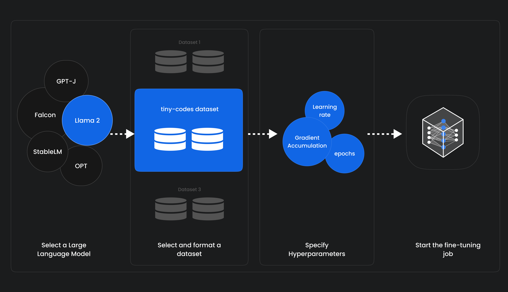

Fine-tune a Large Language Model (LLM) and deploy it on MonsterAPI 🔥

The best part - No coding is required and costs less than a cup of coffee! 🔥

🧵 1/3

-----

@monsterapis designed their no-code LLM fine-tuner that simplifies the process of finetuning by:

👉 Automatically configuring GPU computing environments,

👉 Optimizing memory usage by finding the optimal batch size,

👉 Integrates experiment tracking with WandB, and

👉 Auto configures the pipeline to complete without any errors on their cost-optimised GPU cloud

----

✨ Nowhere during this entire process, did I search for GPUs.

✨ I didn’t have to provision the GPU server, a VM and containerise them.

✨ I didn’t have to setup NVIDIA drivers, libraries and the CUDA environment.

✨ I just used the no-code option and got started within a minute.

✨ Saved me not just a lot of time but immense frustration that generally comes up when dealing with traditional clouds for fine tuning and deployments.

👉 Website : https://monsterapi.ai

----

📌 Checkout this colab for deploying CodeLlama 7B model with LoRA Adapter using MonsterAPI

https://colab.research.google.com/drive/1VW4ReN61sa_zMl92p4g16E8IBwnIfb2e?usp=sharing#scrollTo=waAEIJBdDDtg

-----

The actual process for Finetuning an LLM

📌 Launch MonsterAPI’s finetuning portal, and choose from the latest Large Language Models (LLMs) such as Llama 2 7B, CodeLlama, Falcon, GPT-J 6B or X-Gen.

📌 Dataset Preparation: You can choose from the curated selection of mostly used hugging face datasets with predefined training prompt configuration. OR

You can use your own custom datasets, and we get a good amount of control around how the Dataset needs to be prepared in the right format. The portal provides a text-area in which target columns can be specified. Depending on the type of task chosen, you might need to alter the column names.

📌 Specify Hyperparameter Configuration: such as epochs, learning rate, cutoff length, warmup steps, and so on.

📌 Track stages of your finetuning jobs: Like, view job logs, monitor your job metrics using Weights & Biases. And finally upload model outputs to Hugging Face.

------

📌 Once you have finetuned an LLM on MonsterAPI, you will receive adapter weights as the final output. This adapter contains your fine-tuned model’s weights that Monster will host as an API endpoint using Monster Deploy.

📌 MonsterDeploy optimizes its backend operations using vLLM framework. vLLM is a rapid and user-friendly library for large language model inference and serving, notable for its state-of-the-art serving throughput.

------

👉 Discord (Monsterapis) : https://discord.com/invite/mVXfag4kZN

👉 Chat with their Finetuned Model here (Mistral-7b-No-robots Finetunned LLM)

https://huggingface.co/spaces/qblocks/chat-mistral-7b-norobots

##################################################

## 2nd

##################################################

🧵 2/3

The example code in the image, deploys the Mixtral 8x7b Chat model with GPTQ 4bit quantization with a 48GB GPU through Monster Deploy.

The Deployment will be able to serve the model as a REST API for both static and streaming token response support.

#######################################################

## 3rd

#######################################################

🧵 3/3

Once the deployment is live, let's query the deployed LLM endpoint.

===================

