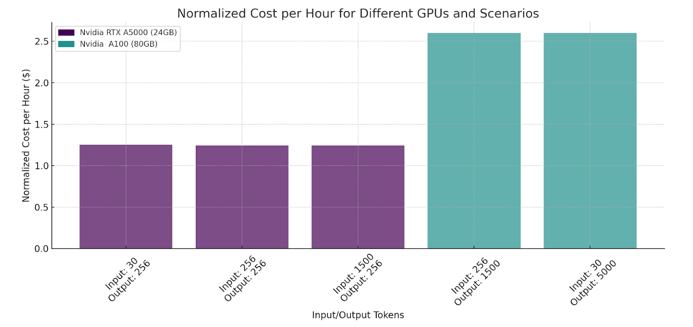

🤔 Thinking of deploying a popular Large Language Model (LLM) or a custom fine-tuned one, in production with low-cost and low-complexity ❓

✨ Monster-API is one "THE BEST" option - gateway to seamlessly deploy LLMs and docker containers on its robust GPU compute infrastructure. A wide range of use cases and demonstrates flexibility in situations such as Quick QA, quick commands, data summarization, and sophisticated queries.

✨ Quickly get an API endpoint that can start serving text generation requests using models like Llama2 7B, CodeLlama 34B, Falcon 40B or any of your custom/finetuned models.

✨ Developed with the vLLM (Variably-Large Language Models) project as its foundation, the Deploy service is optimized for high throughput.

✨ As per their official blog, they were able to serve Zephyr-7b, a SOTA Open source 7B param LLM, at an incredibly economical rate of $1.25/hr, serving 39K requests per hour with an average request latency of 16ms on a 24GB GPU. A total of 10 million tokens generated in an hour.

And this was using Monster Deploy on GPUs such as Nvidia RTX A5000 (24GB)  and A100 (80GB).

----

I've worked a ton with @monsterapis and in their deployment platform you get the following.

📌 Seamless experience with its intuitive UI

📌 Python client or a single curl request.

📌 Supports deployment of LLMs as a REST API endpoint and any custom docker image as a hosted docker container.

📌 Choose from a range of GPU and RAM configurations upto 160GB of VRAM

📌 Detailed API documentations with demo notebook.

👉 Website : https://monsterapi.ai

🧵 1/3

=================================

A recent benchmark test of Monster Deploy of the Zephyr 7B model onto an 80GB Nvidia RTX A100, demonstrated its exceptional performance.

👉 Number of users (peak concurrency): 200

👉 Spawn Rate (users started/second): 1

👉 Run Time: 15m

👉 Input Token Length: 256 Tokens (max)

👉 Output Token Length: 1500 Tokens (max)

👉 Cost: $0.65 :arrow

=================================


🧵 1/3

To access Monster Deploy Beta:

Step 1: Sign up on MonsterAPI platform.
Step 2: Apply for Monster Deploy Beta. Use your organization/business email for free 30K credits.

=================================

The example code in image, deploys the Mixtral 8x7b Chat model with GPTQ 4bit quantization by using a 48GB GPU, using Monster Deploy.

The Deployment will be able to serve the model as a REST API for both static and streaming token response support.


```py
!python3 -m pip install monsterapi==1.0.2b3
# install specific beta version of client for quick serve access.

api_key = "YOUR_MONSTER_API_KEY"
from monsterapi import client as mclient
deploy_client = mclient(api_key = api_key)

# deploy Mixtral 8x7b Chat model with GPTQ 4bit quantization
# using a 48GB GPU.
basemodel_path="TheBloke/Mixtral-8x7B-Instruct-v0.1-GPTQ"
    prompt_template="<s> [INST] {instruction} [/INST] {completion}</s>"
    api_auth_token="A_RANDOM_AUTH_TOKEN_TO_SECURE_YOUR_ENDPOINT"
    per_gpu_vram=48
    gpu_count=1

# Launch a deployment
launch_payload = {
    "basemodel_path": "TheBloke/Mixtral-8x7B-Instruct-v0.1-GPTQ",
    "prompt_template": "<s> [INST] {prompt} [/INST] {completion}</s>",
    "api_auth_token": "b6a97d3b-35d0-4720-a44c-59ee33dbc25b",
    "per_gpu_vram": 48,
    "gpu_count": 1,
    "use_nightly": True
}

# Launch a deployment
ret = deploy_client.deploy("llm", launch_payload)
deployment_id = ret.get("deployment_id")
print(deployment_id)
"""
{
     "status":"live",
     "message":"Server has started !!!",
     "URL":"https://c503a813-850a-4a78-93b9.monsterapi.ai",
     "api_auth_token":"57b7b903-a4b6-4720-8154-af71aa8e8313"
 }
 visit the url to get the llm service endpoint details
 or above url/docs to get swagger docs
"""

```

=================================

Once the deployment is live, let's query our deployed LLM endpoint

```py
import json

status_debug = True # Just a placeholder to show possible statuses.

if status_debug:
  status_ret = deploy_client.get_deployment_status(deployment_id)
  print(status_ret)

# 'status' will be initially set to "building" and then to "live"
# as the deployment configuration progresses and
#the logs will be available from building state onwards.

logs_ret = deploy_client.get_deployment_logs(deployment_id, n_lines = 50)
if 'logs' not in logs_ret:
  raise Exception("Please wait until status changes to building!")
for i in logs_ret['logs']:
  print(i)

```

============================

Once the deployment is live, let's query our deployed LLM endpoint:

```py
assert status_ret.get("status") == "live", "Please wait until status is live!"

service_client  = mclient(api_key = status_ret.get("api_auth_token"),
                          base_url = status_ret.get("URL"))

payload = {
    "input_variables": {
        "prompt": "What's up?"},
        "stream": False,
        "temperature": 0.6,
        "max_tokens": 2048
}

output = service_client.generate(model = "deploy-llm", data = payload)

if payload.get("stream"):
    for i in output:
        print(i[0])
else:
    print(json.loads(output)['text'][0])

```

=================================

Once your work is done, you may terminate your LLM deployment and stop the account billing

```py
terminate_return = deploy_client.terminate_deployment(deployment_id)
print(terminate_return)

```

=================================


🧵 1/3

Below report showcase a benchmark of serving Zephyr-7b, a SOTA Open source 7B parameter LLM, using Monster Deploy on GPUs such as Nvidia RTX A5000 (24GB)  and A100 (80GB) in multiple scenarios.


=================================

Cost For Different Scenarios



===================

Signup Here - https://developer.monsterapi.ai/docs/monster-deploy-beta#beta-phase--feedback

API Docs of Monster-Deploy - https://developer.monsterapi.ai/docs/monster-deploy-beta

👉 Discord (Monsterapis) : https://discord.com/invite/mVXfag4kZN

👉 Chat with their Finetuned Model here (Mistral-7b-No-robots Finetunned LLM)

https://huggingface.co/spaces/qblocks/chat-mistral-7b-norobots
